# n8n-Workflows für den deutschen Mittelstand

Praxiserprobte n8n-Automatisierungen auf Deutsch — mit DSGVO- und EU-AI-Act-Hinweisen,
Plausibilitätsprüfungen und einer Kurzanleitung direkt im Canvas.

**Warum noch eine Workflow-Sammlung?** Weil die großen Sammlungen englischsprachig sind und
Masse über Qualität stellen. Hier gilt das Gegenteil: Jeder Workflow ist importierbar
(automatisch validiert), auf deutsche Betriebsabläufe zugeschnitten und dokumentiert.
Wo personenbezogene Daten oder KI-Inhalte im Spiel sind, steht der rechtliche Hinweis dabei.

## Kategorien

| Ordner | Inhalt |
|---|---|
| [`01-vertrieb-leads`](workflows/01-vertrieb-leads) | Leads erfassen, anreichern, nachfassen |
| [`02-rechnungen-buchhaltung`](workflows/02-rechnungen-buchhaltung) | Eingangsrechnungen, Mahnwesen, Vorkontierung |
| [`03-email-kommunikation`](workflows/03-email-kommunikation) | Posteingang sortieren, Entwürfe, Newsletter |
| [`04-ki-agenten-rag`](workflows/04-ki-agenten-rag) | Firmenwissen als RAG, Assistenten, lokale Modelle |
| [`05-marketing-content`](workflows/05-marketing-content) | Social Media, SEO-Briefings |
| [`06-kundenservice`](workflows/06-kundenservice) | FAQ-Chatbot, Reklamationen |
| [`07-daten-reporting`](workflows/07-daten-reporting) | KPI-Berichte, Wettbewerbsbeobachtung |
| [`08-dsgvo-compliance`](workflows/08-dsgvo-compliance) | KI-Inventar, Auskunftsersuchen |
| [`09-handwerk-produktion`](workflows/09-handwerk-produktion) | Terminvorschläge, Wartungsplanung |
| [`10-personal-hr`](workflows/10-personal-hr) | Bewerbungen vorprüfen, Onboarding |

## Alle Workflows im Überblick

### Vertrieb Leads

| | Workflow | Was er tut |
|---|---|---|
| 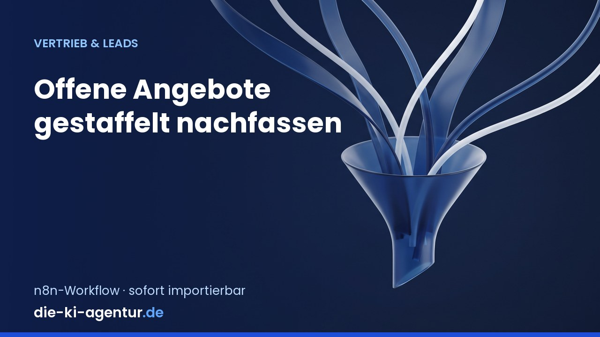 | [Offene Angebote gestaffelt nachfassen](workflows/01-vertrieb-leads/angebot-nachfassen-automatisch.json) | Prueft jeden Morgen die offenen Angebote in einer Google-Sheets-Liste, berechnet ihr Alter und faellt daraus die Nachfassentscheidung: nach 3 Tagen eine freundliche Erinnerung, nach 10 Tagen eine zweite Nachfrage, nach 21 Tagen ein internes Signal an den Vertrieb statt einer weiteren Mail. |
| 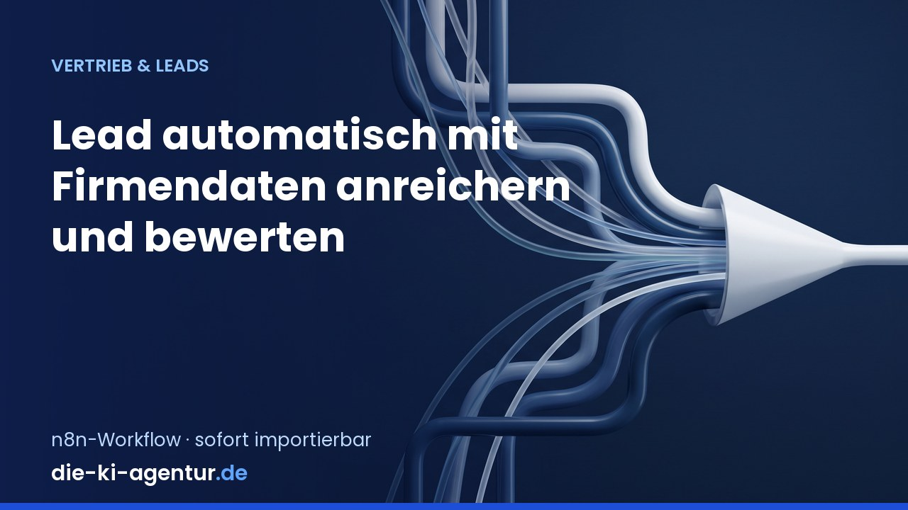 | [Lead automatisch mit Firmendaten anreichern und bewerten](workflows/01-vertrieb-leads/lead-anreicherung-firmendaten.json) | Nimmt einen neuen Lead per Webhook entgegen, leitet aus der E-Mail-Adresse die Firmendomain ab und trennt Geschaeftsadressen von Freemail-Adressen (gmail. |
| 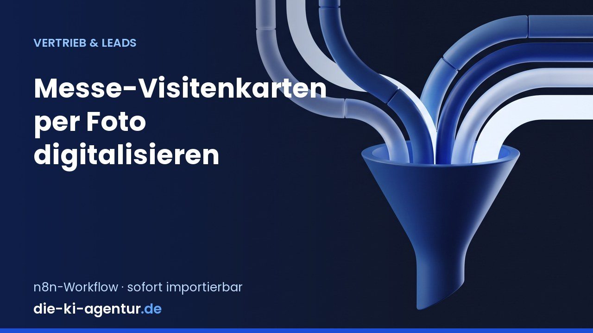 | [Messe-Visitenkarten per Foto digitalisieren](workflows/01-vertrieb-leads/messe-visitenkarten-digitalisieren.json) | Der Aussendienst fotografiert eine Visitenkarte und laedt sie ueber ein n8n-Formular hoch; die KI liest Name, Firma, Position, E-Mail und Telefon aus dem Bild, eine Plausibilitaetspruefung kontrolliert Mailformat und Telefonnummer, und der Kontakt landet mitsamt Messe- und Gespraechsnotiz im CRM. |
| 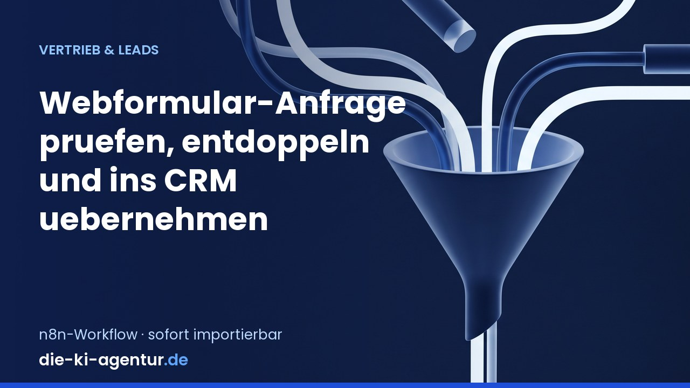 | [Webformular-Anfrage pruefen, entdoppeln und ins CRM uebernehmen](workflows/01-vertrieb-leads/webformular-lead-ins-crm.json) | Nimmt Anfragen aus dem Kontakt- oder Angebotsformular der Website per Webhook entgegen, prueft die Pflichtfelder, gleicht die E-Mail-Adresse gegen bestehende CRM-Kontakte ab und legt entweder einen neuen Lead an oder haengt eine Notiz an den vorhandenen Kontakt. |

### Rechnungen Buchhaltung

| | Workflow | Was er tut |
|---|---|---|
| 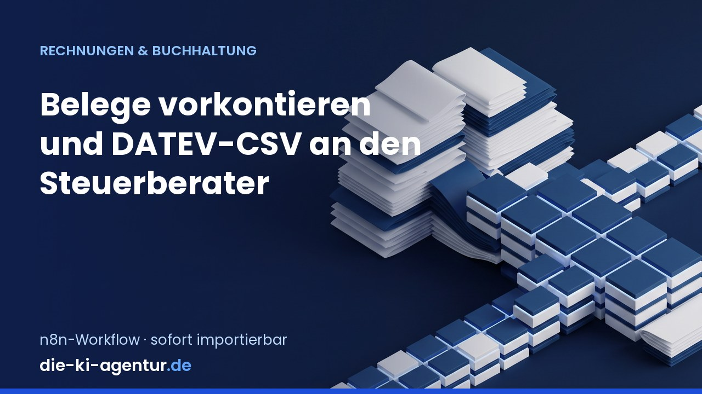 | [Belege vorkontieren und DATEV-CSV an den Steuerberater](workflows/02-rechnungen-buchhaltung/belege-vorkontieren.json) | Holt neue Belege aus einem Google-Drive-Ordner, extrahiert den PDF-Text und laesst die KI ein SKR03-Konto, eine Kostenstelle und einen Buchungstext samt Konfidenzwert vorschlagen. |
| 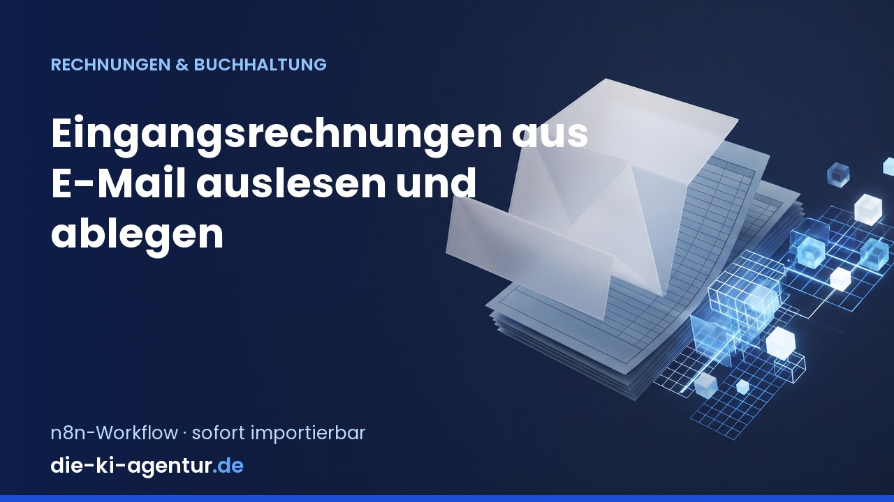 | [Eingangsrechnungen aus E-Mail auslesen und ablegen](workflows/02-rechnungen-buchhaltung/eingangsrechnungen-auslesen.json) | Holt PDF-Rechnungen aus einem IMAP-Postfach, liest Rechnungsnummer, Datum, Betrag, USt und Lieferant per KI aus, legt sie strukturiert in Google Sheets ab und meldet Unstimmigkeiten. |
| 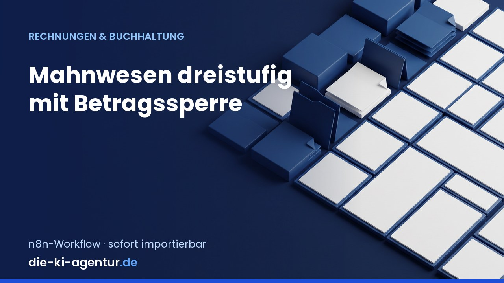 | [Mahnwesen dreistufig mit Betragssperre](workflows/02-rechnungen-buchhaltung/mahnwesen-gestaffelt.json) | Prueft taeglich die offenen Posten aus Google Sheets, berechnet die Ueberfaelligkeit und faehrt eine dreistufige Staffel: ab 7 Tagen freundliche Zahlungserinnerung, ab 21 Tagen erste Mahnung mit Verzugshinweis, ab 40 Tagen interne Eskalation an die Geschaeftsfuehrung statt Automatik-Mail. |

### Email Kommunikation

| | Workflow | Was er tut |
|---|---|---|
|  | [Newsletter-Entwurf aus neuen Blogartikeln erzeugen](workflows/03-email-kommunikation/newsletter-aus-blogartikel.json) | Liest einmal woechentlich den RSS-Feed der eigenen Website, filtert die seit dem letzten Lauf neu erschienenen Artikel heraus und laesst die KI daraus eine Newsletter-Zusammenfassung mit zwei Betreffzeilen-Varianten fuer einen A/B-Test schreiben. |
| 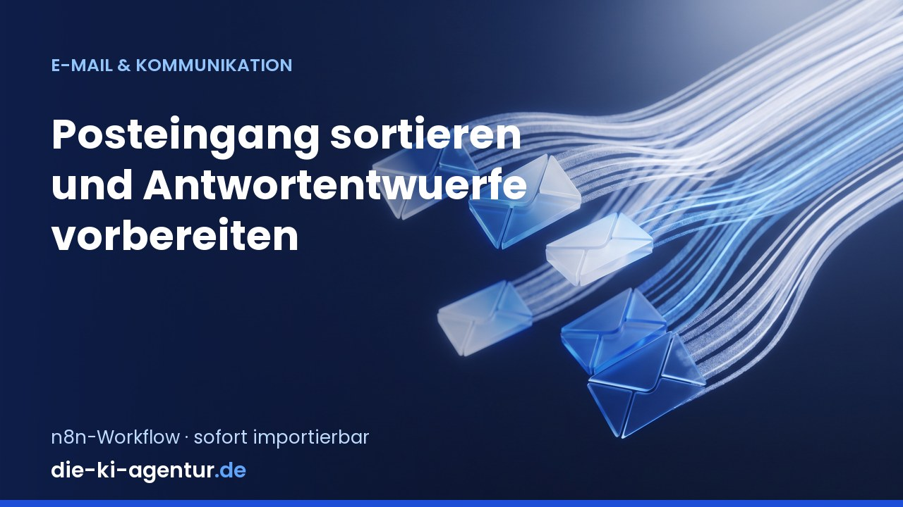 | [Posteingang sortieren und Antwortentwuerfe vorbereiten](workflows/03-email-kommunikation/posteingang-sortieren-entwuerfe.json) | Liest neue Mails per IMAP, faengt Bounces und Abwesenheitsnotizen in einem eigenen Zweig ab und laesst die KI jede echte Mail in Anfrage, Bestellung, Reklamation, Rechnung, Newsletter oder Spam einsortieren - inklusive Konfidenzwert. |

### Ki Agenten Rag

| | Workflow | Was er tut |
|---|---|---|
| 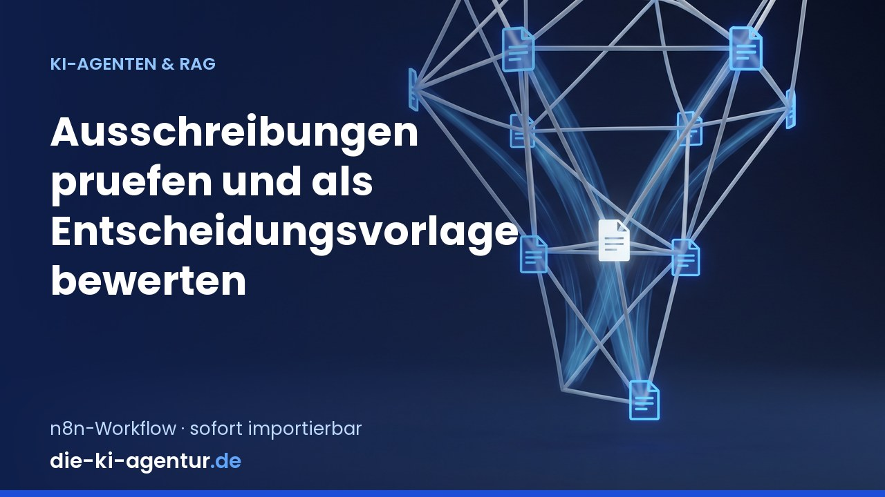 | [Ausschreibungen pruefen und als Entscheidungsvorlage bewerten](workflows/04-ki-agenten-rag/angebots-agent-ausschreibungen.json) | Ueber ein Formular wird eine Ausschreibung als PDF hochgeladen. |
| 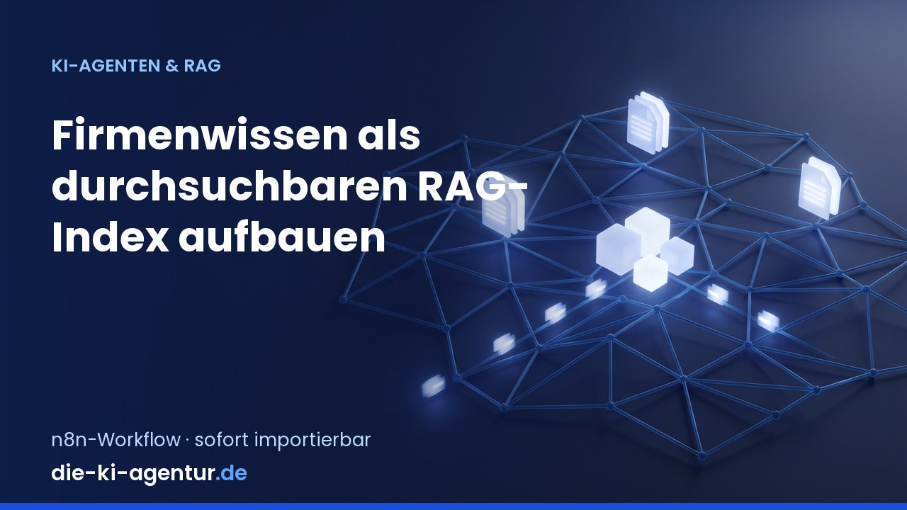 | [Firmenwissen als durchsuchbaren RAG-Index aufbauen](workflows/04-ki-agenten-rag/firmenwissen-rag-aufbauen.json) | Baut naechtlich aus einer Dokumentenliste (Google Sheets) einen durchsuchbaren Wissensindex: Datei laden, Text extrahieren, in ueberlappende Abschnitte teilen, Embeddings erzeugen und in einen Vector Store (Qdrant, alternativ Supabase/pgvector) schreiben. |
| 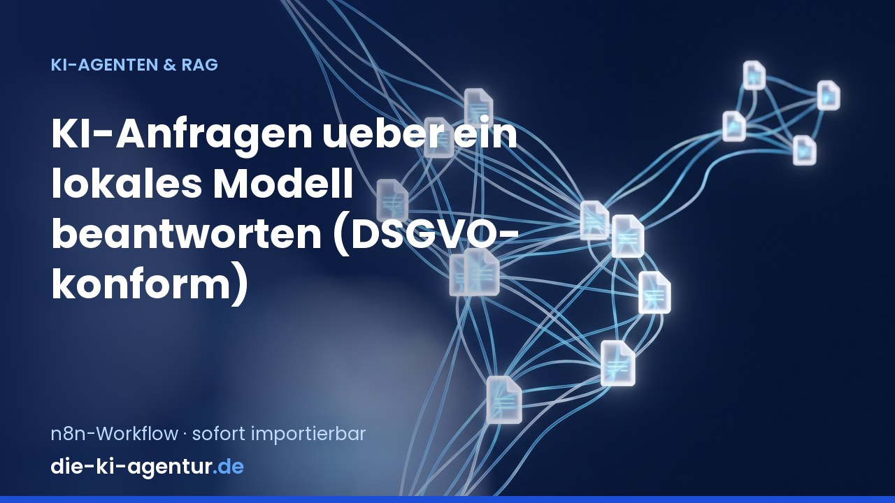 | [KI-Anfragen ueber ein lokales Modell beantworten (DSGVO-konform)](workflows/04-ki-agenten-rag/lokale-ki-dsgvo-konform.json) | Nimmt Anfragen per Webhook entgegen und beantwortet sie mit einem lokal gehosteten Modell (Ollama auf demselben Server), sodass keine Inhalte an einen Cloud-Anbieter gehen; protokolliert werden nur Metadaten, keine Texte. |
| 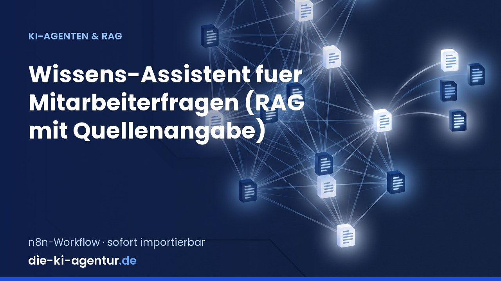 | [Wissens-Assistent fuer Mitarbeiterfragen (RAG mit Quellenangabe)](workflows/04-ki-agenten-rag/wissens-assistent-abfragen.json) | Nimmt Mitarbeiterfragen per Webhook entgegen und beantwortet sie mit einem KI-Agenten, der ausschliesslich im eigenen Firmenwissen-Index (Vector Store) sucht und jede Aussage mit dem Dokumentnamen belegt. |

### Marketing Content

| | Workflow | Was er tut |
|---|---|---|
| 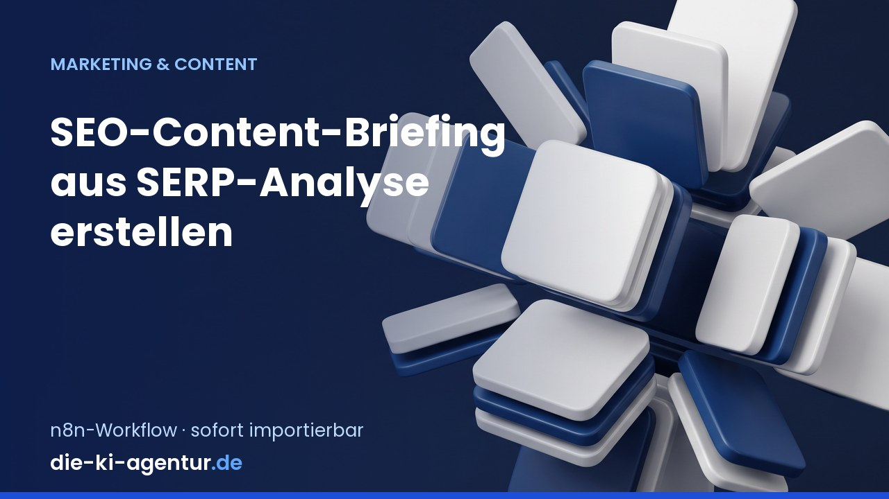 | [SEO-Content-Briefing aus SERP-Analyse erstellen](workflows/05-marketing-content/seo-content-briefing.json) | Die Redaktion traegt ein Keyword in ein Formular ein, der Workflow holt die aktuellen Suchergebnisse ueber eine SERP-API (Platzhalter fuer DataForSEO oder SerpAPI), wertet die Top-Treffer aus und laesst die KI daraus ein Content-Briefing bauen: Suchintention, Gliederung mit H2/H3, Fragen die der Text beantworten muss, empfohlene Wortzahl und interne Verlinkungsideen. |
|  | [Social-Media-Beitraege aus Blogartikeln erzeugen (mit Freigabe)](workflows/05-marketing-content/social-media-aus-blogartikel.json) | Liest taeglich den Blog-RSS-Feed, erkennt neue Artikel und laesst die KI daraus plattformspezifische Beitraege texten: LinkedIn sachlich-fachlich, Instagram kuerzer und direkter, jeweils mit Hashtag-Vorschlaegen und einem Bild-Prompt. |

### Kundenservice

| | Workflow | Was er tut |
|---|---|---|
| 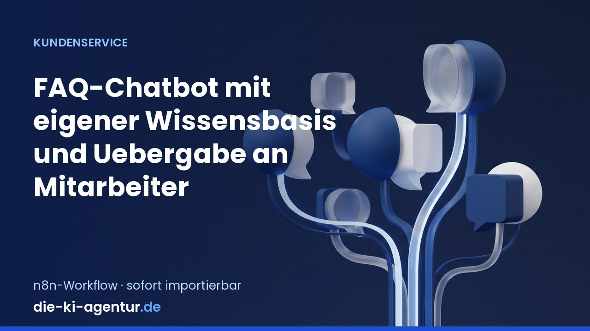 | [FAQ-Chatbot mit eigener Wissensbasis und Uebergabe an Mitarbeiter](workflows/06-kundenservice/faq-chatbot-mit-wissensbasis.json) | Nimmt Chat-Anfragen per Webhook entgegen, sucht die passenden Stellen in der eigenen Wissensbasis (Vector Store oder Retrieval-API, als Platzhalter hinterlegt) und laesst einen KI-Agenten ausschliesslich aus diesen Treffern antworten - mit Quellenangabe und Konfidenzwert. |
| 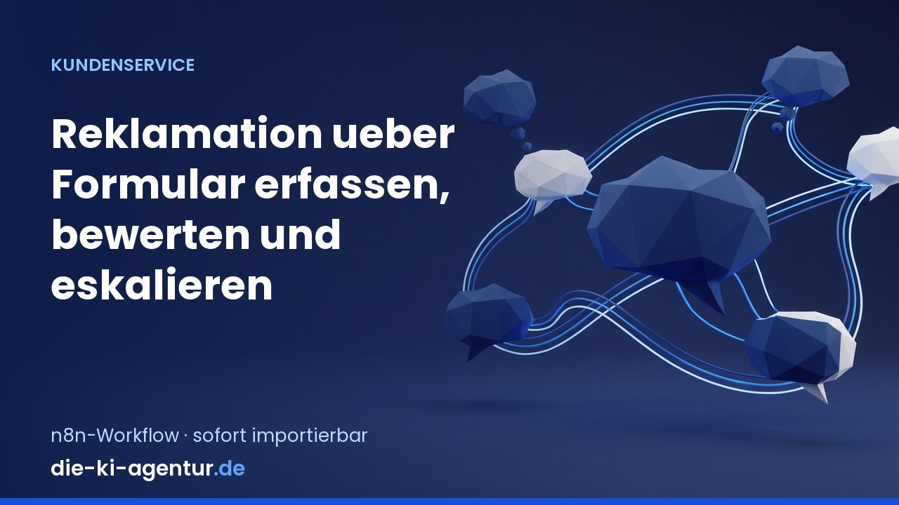 | [Reklamation ueber Formular erfassen, bewerten und eskalieren](workflows/06-kundenservice/reklamation-erfassen-eskalieren.json) | Nimmt Reklamationen ueber ein n8n-Formular auf (Bestellnummer, Problembeschreibung, Foto-Upload), prueft die Angaben auf Plausibilitaet und Gewaehrleistungsfrist und laesst die KI Schweregrad und Sachgebiet bestimmen. |

### Daten Reporting

| | Workflow | Was er tut |
|---|---|---|
| 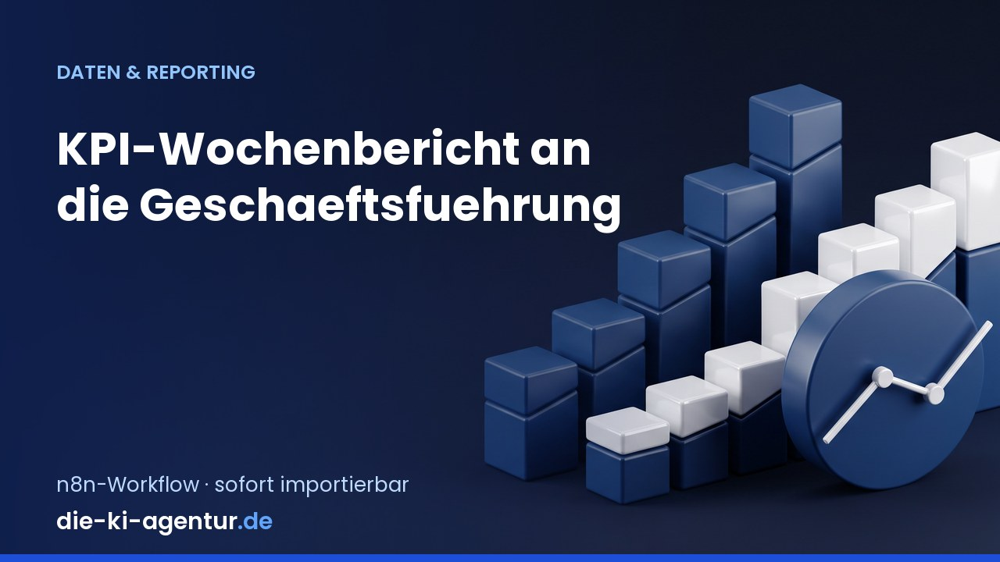 | [KPI-Wochenbericht an die Geschaeftsfuehrung](workflows/07-daten-reporting/kpi-wochenbericht.json) | Sammelt montags um 7 Uhr die Zahlen der Vorwoche aus zwei Quellen - Umsaetze aus Google Sheets und offene Angebote aus der Warenwirtschaft per HTTP-API - und berechnet Umsatz, Auftragseingang, Angebots-Conversion und die Veraenderung zur Vorwoche in Prozent. |
| 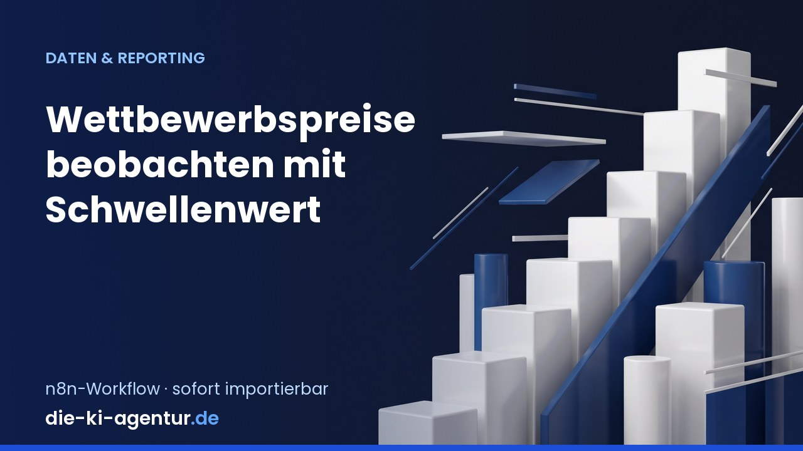 | [Wettbewerbspreise beobachten mit Schwellenwert](workflows/07-daten-reporting/preise-wettbewerb-beobachten.json) | Ruft taeglich die in einem Google Sheet gepflegten Wettbewerber-URLs ab, liest den Preis zuerst ueber einen hinterlegten CSS-Selektor und faellt nur bei Misserfolg auf die KI zurueck, vergleicht ihn mit dem eigenen Preis und schreibt jeden Lauf in eine Historie. |

### Dsgvo Compliance

| | Workflow | Was er tut |
|---|---|---|
| 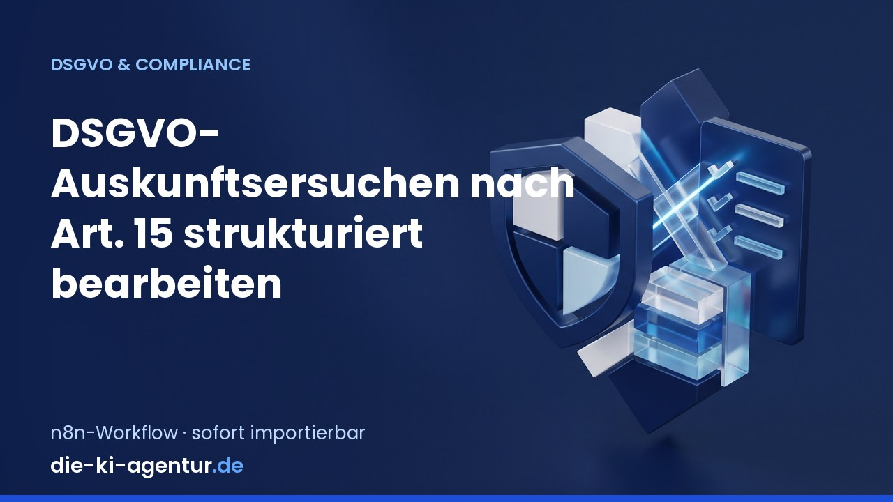 | [DSGVO-Auskunftsersuchen nach Art. 15 strukturiert bearbeiten](workflows/08-dsgvo-compliance/auskunftsersuchen-bearbeiten.json) | Nimmt Auskunftsersuchen nach Art. |
| 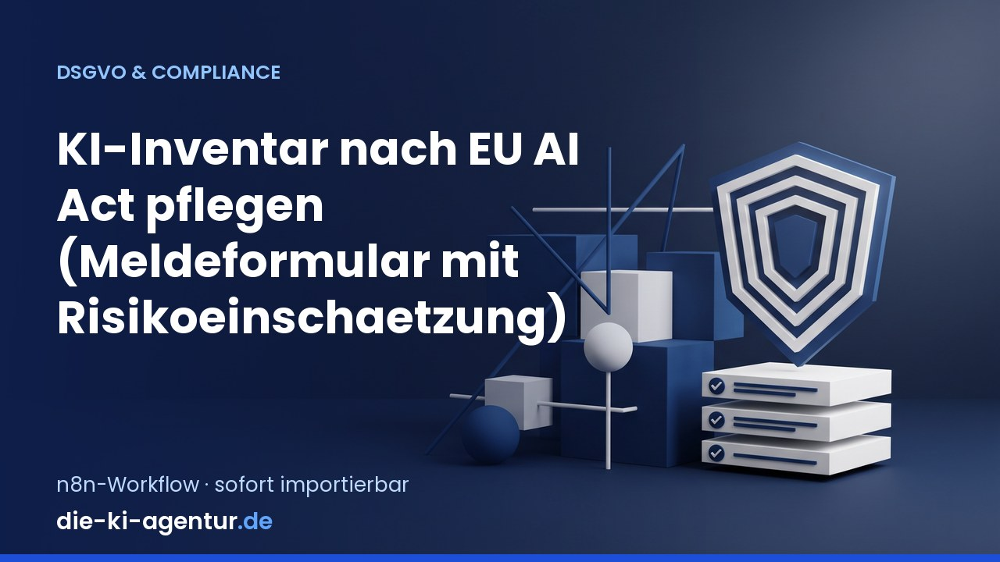 | [KI-Inventar nach EU AI Act pflegen (Meldeformular mit Risikoeinschaetzung)](workflows/08-dsgvo-compliance/ki-inventar-pflegen.json) | Abteilungen melden ueber ein Formular, welche KI-Systeme sie einsetzen — System, Zweck, Datenarten, Anbieter, Rechtsgrundlage. |

### Handwerk Produktion

| | Workflow | Was er tut |
|---|---|---|
| 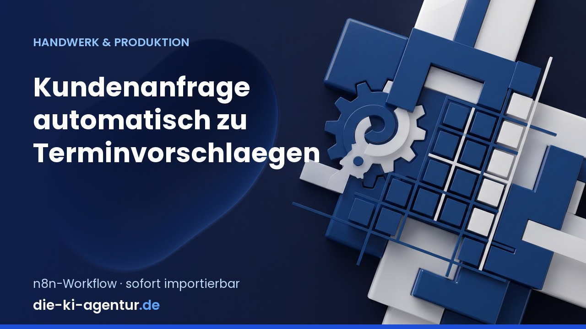 | [Kundenanfrage automatisch zu Terminvorschlaegen](workflows/09-handwerk-produktion/anfrage-zu-terminvorschlag.json) | Nimmt Kundenanfragen ueber ein Web-Formular an, laesst die KI Gewerk, Taetigkeit, Ort und Dringlichkeit herauslesen, gleicht die Termine gegen den Betriebskalender ab und schickt dem Kunden zwei bis drei konkrete Terminvorschlaege per E-Mail. |
| 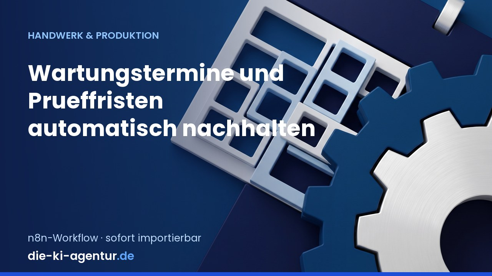 | [Wartungstermine und Prueffristen automatisch nachhalten](workflows/09-handwerk-produktion/wartungstermine-erinnern.json) | Prueft einmal im Monat die Anlagenliste eines Handwerks- oder Produktionsbetriebs, rechnet aus Wartungsintervall und gesetzlicher Prueffrist aus, welche Anlagen faellig oder ueberfaellig sind, und schickt den Kunden ein Terminangebot. |

### Personal Hr

| | Workflow | Was er tut |
|---|---|---|
| 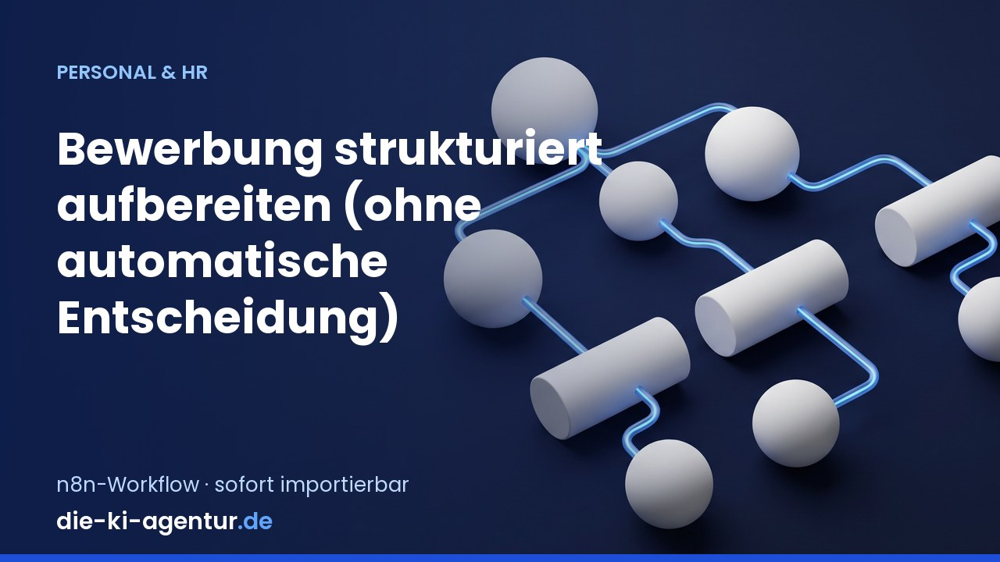 | [Bewerbung strukturiert aufbereiten (ohne automatische Entscheidung)](workflows/10-personal-hr/bewerbung-vorpruefen.json) | Nimmt Bewerbungen ueber ein Formular mit Lebenslauf-Upload entgegen, extrahiert den Text und laesst die KI die Qualifikationen strukturiert zusammenfassen und den hinterlegten Stellenanforderungen gegenueberstellen. |
| 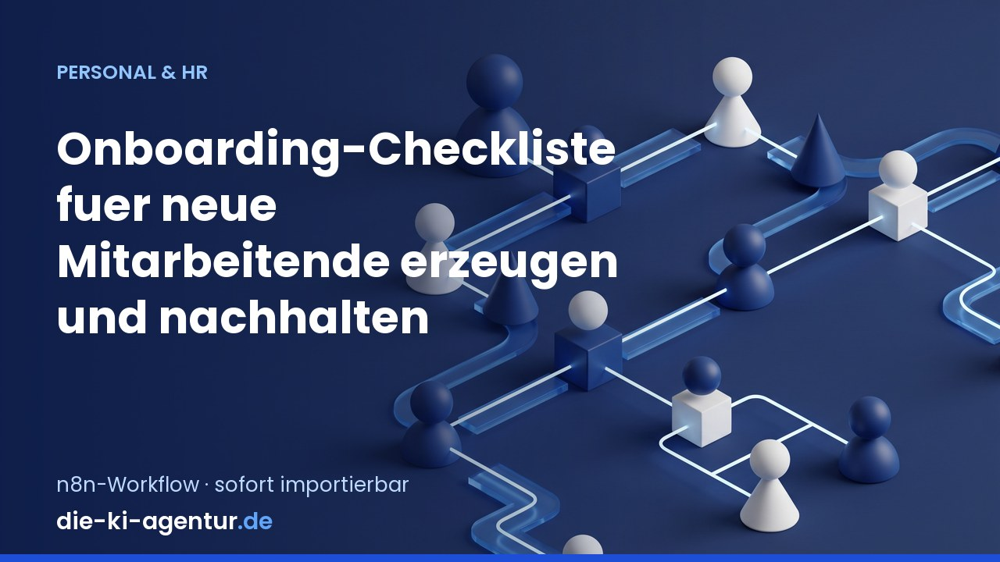 | [Onboarding-Checkliste fuer neue Mitarbeitende erzeugen und nachhalten](workflows/10-personal-hr/onboarding-checkliste.json) | Wird vom Personalsystem per Webhook angestossen, sobald eine Einstellung feststeht: Der Workflow erzeugt aus Abteilung, Rolle und Eintrittsdatum eine vollstaendige Onboarding-Checkliste (IT-Zugaenge, Arbeitsplatz und Hardware, Pflichtunterweisungen, Dokumente, Organisation), setzt je Aufgabe eine Frist relativ zum ersten Arbeitstag, verteilt die Aufgabenpakete an IT, Facility, Buchhaltung und Fuehrungskraft, protokolliert alles in Google Sheets und erinnert bei ueberfaelligen Punkten. |

## Verwendung

1. JSON-Datei herunterladen
2. In n8n: **Workflows → Import from File**
3. Zugangsdaten hinterlegen (im JSON stehen bewusst nur Platzhalter, nie echte Schlüssel)
4. Die Sticky Note im Canvas nennt die konkreten Voraussetzungen
5. Erst inaktiv testen, dann scharfschalten

## Qualitätssicherung

Jeder Workflow durchläuft `scripts/validate.py`. Geprüft wird, was beim Import real scheitert:

```bash
python3 scripts/validate.py
```

Kaputtes JSON, Verbindungen auf nicht existierende Nodes, verwaiste Nodes, fehlende Trigger,
doppelte Namen — und ob versehentlich ein echter API-Schlüssel im JSON gelandet ist.

## Rechtliche Hinweise

Die Workflows sind Vorlagen, keine Rechtsberatung. Zwei wiederkehrende Punkte:

- **DSGVO:** Sobald personenbezogene Daten an einen KI-Anbieter gehen, braucht es einen
  Auftragsverarbeitungsvertrag — oder ein lokal betriebenes Modell.
- **EU AI Act:** Die KI-Kompetenzpflicht nach Artikel 4 gilt seit 02.02.2025, die
  Transparenzpflichten nach Artikel 50 und die Hochrisiko-Regeln nach Anhang III seit
  02.08.2026. Chatbots müssen sich als KI zu erkennen geben, KI-generierte Inhalte
  gekennzeichnet werden. Anhang I folgt am 02.08.2027.

Eine ausführliche Einordnung samt kostenlosem Compliance-Kit:
[die-ki-agentur.de/eu-ai-act](https://die-ki-agentur.de/eu-ai-act/)

## Wer dahintersteht

Gepflegt von [**die KI Agentur**](https://die-ki-agentur.de/) aus Hechingen — wir bauen und
betreiben Automatisierungen für mittelständische Unternehmen.

- [n8n-Agentur: Workflows umsetzen lassen](https://die-ki-agentur.de/n8n-agentur/)
- [n8n-Hosting in Deutschland](https://die-ki-agentur.de/n8n-hosting-deutschland/)
- [KI-Schulungen nach Artikel 4 EU AI Act](https://die-ki-agentur.de/ki-schulung/)
- [Kostenloses EU AI Act Compliance Kit (PDF)](https://die-ki-agentur.de/downloads/eu-ai-act-compliance-kit.pdf)

Fragen und Erfahrungsaustausch: [r/ki_agentur](https://www.reddit.com/r/ki_agentur/)

## Beitragen

Pull Requests willkommen. Bitte `docs/WORKFLOW-SPEC.md` lesen und vor dem PR
`python3 scripts/validate.py` laufen lassen.

## Lizenz

MIT — kommerzielle Nutzung ausdrücklich erlaubt. Ohne Gewähr; vor dem Produktiveinsatz testen.
